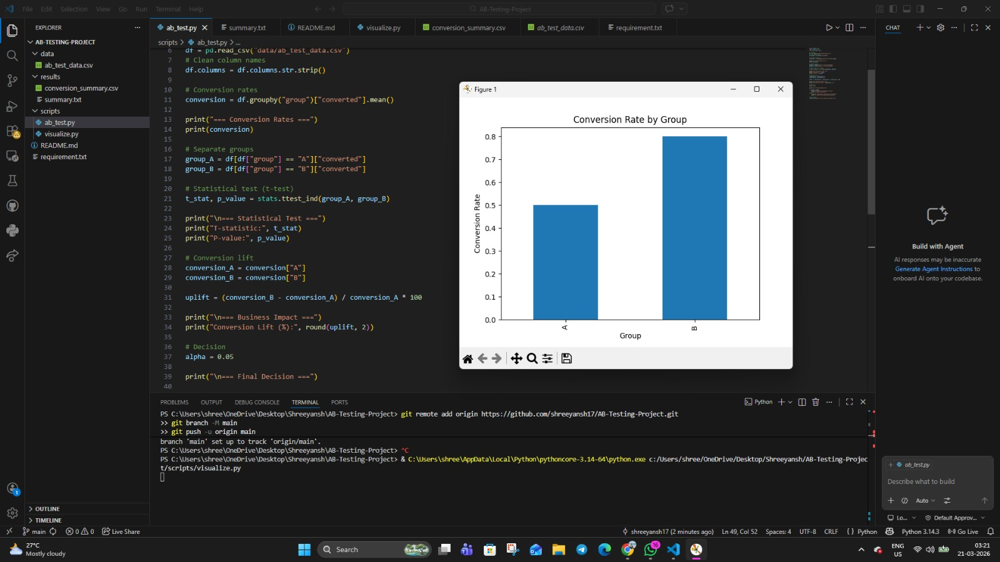

# Conversion Optimization using A/B Testing

## 📌 Overview
This project performs A/B testing to compare two versions (A and B) of a feature and determine which performs better based on conversion rate and statistical significance.

## 🛠 Tools Used
- Python
- Pandas
- NumPy
- SciPy
- Matplotlib

## ⚙️ Process
- Calculated conversion rates for both groups
- Performed statistical t-test to evaluate significance
- Measured conversion uplift
- Generated visualization for comparison

## 📊 Results
- Version B shows higher conversion rate than Version A
- However, p-value > 0.05, indicating no statistically significant difference

## 📈 Business Impact
Although Version B appears better, the result is not statistically significant. More data should be collected before making a final decision.

## 📊 Visualization

## 🚀 How to Run
1. Navigate to scripts folder  
2. Run:
   python ab_test.py  
3. For visualization:
   python visualize.py